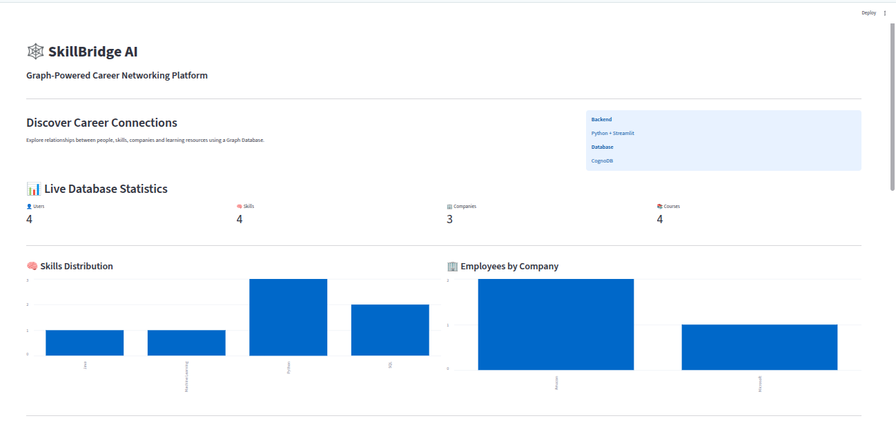
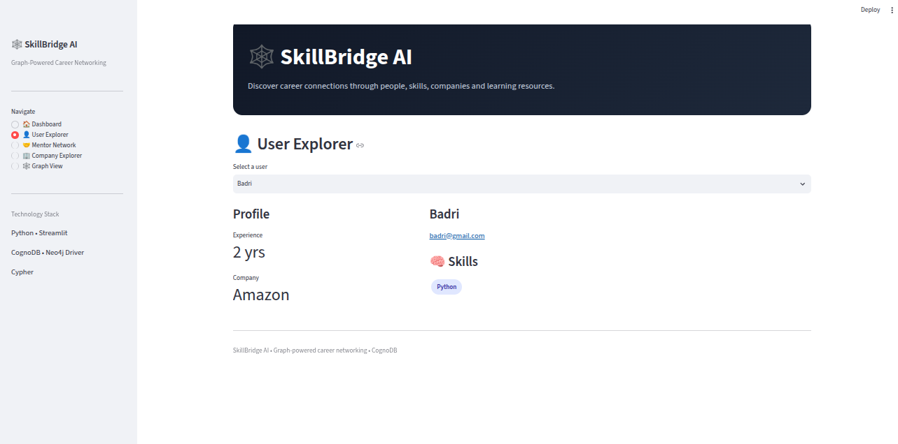
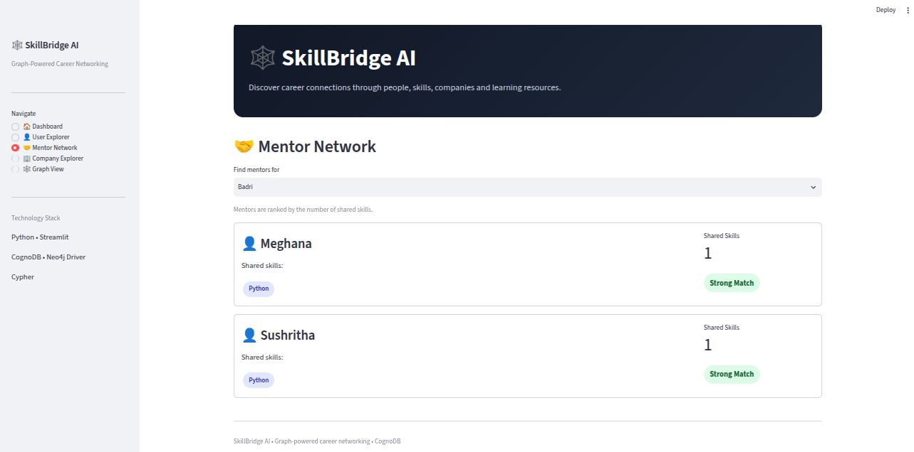
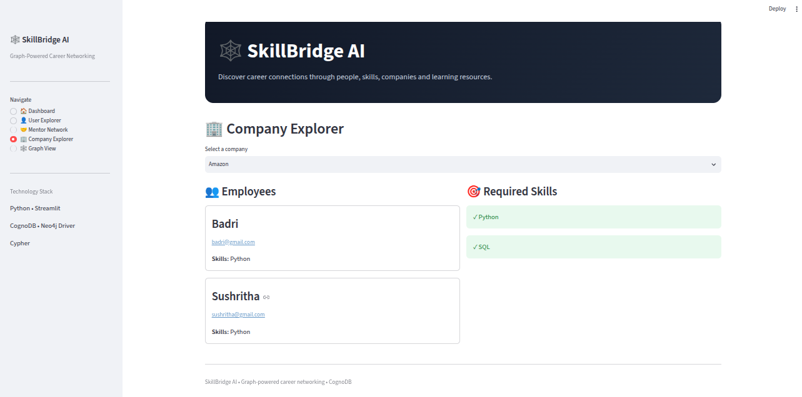

# 🕸️ SkillBridge AI

A graph-powered career networking platform built using **CognoDB** and **Streamlit**.

## Overview

SkillBridge AI helps users discover mentors, explore companies, and visualize relationships between people, skills, companies, and courses using a graph database.

## Why a Graph Database?

This application is relationship-centric. Features like mentor recommendation require traversing multiple connected nodes:

**User → Skill ← User**

In a relational database this would require multiple joins, whereas a graph database performs these traversals naturally using Cypher.

## Graph Data Model

The application models career connections as a graph:

```text
              ┌──────────────┐
              │     User     │
              └──────┬───────┘
                     │
                HAS_SKILL
                     │
                     ▼
              ┌──────────────┐
              │    Skill     │
              └──────┬───────┘
                     ▲
                HAS_SKILL
                     │
              ┌──────┴───────┐
              │     User     │
              └──────────────┘

User ──WORKS_AT──────► Company
                         │
                    REQUIRES_SKILL
                         │
                         ▼
                       Skill

User ──TEACHES──────► Course
## Features

* User Explorer
* Mentor Recommendations
* Company Explorer
* Required Skills Explorer
* Live Analytics Dashboard
* Interactive Charts

## Tech Stack

* Python
* Streamlit
* CognoDB Cloud
* Neo4j Python Driver
* Cypher

## Project Structure

```text
skillbridge-ai/
│
├── app.py
├── seed.py
├── requirements.txt
├── README.md
│
└── db/
    ├── connection.py
    ├── queries.py
    └── __init__.py
```

## Setup

1. Create a free CognoDB instance.
2. Create a `.env` file:

```env
DB_URI=your_uri
DB_USER=cognodb
DB_PASSWORD=your_password
```

3. Install dependencies:

```bash
pip install -r requirements.txt
```

4. Load seed data:

```bash
python seed.py
```

5. Run the application:

```bash
streamlit run app.py
```

## Main Cypher Queries
###  Mentor Recommendation

The mentor recommendation uses a multi-hop graph traversal:

```text
User → Skill ← User

### Company Explorer

Retrieves employees connected to a company.

### Required Skills

Displays skills required by selected companies.

## Screenshots

### Home Dashboard



### User Explorer



### Mentor Recommendations



### Company Explorer


## Author

**Meghana Dasari**

B.Tech – Data Science & Artificial Intelligence
